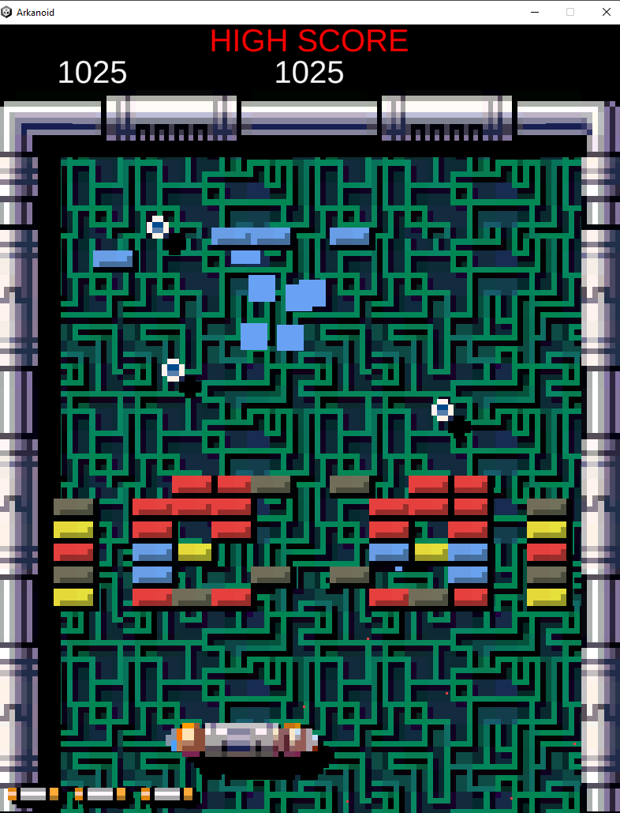
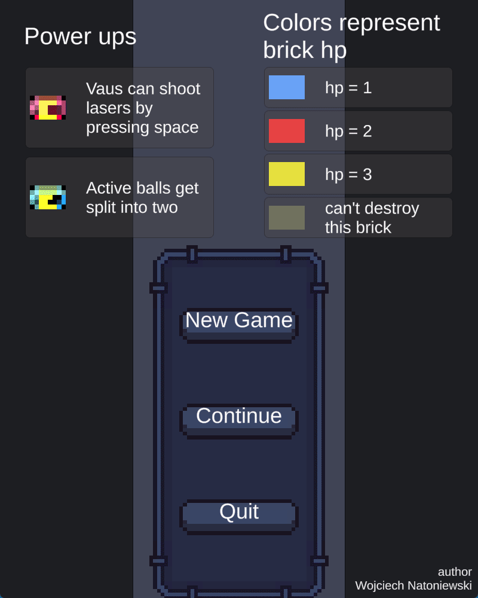
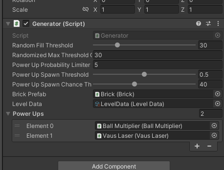
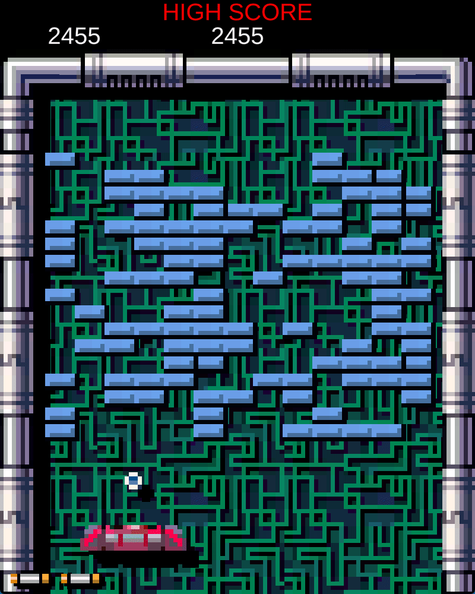

# ARKANOID

Projekt gry stworzony został w ok. 5 dni na potrzeby zadania rekrutacyjnego. Gra tworzona została w multi scene workflow - podzieliłem projekt na scene UI, Level oraz managery.
Informacje o poziomie, takie jak kolor bloków, stałe poziomu itd. zawarte są w dowolnej chwili w pliku ScriptableObject [LevelData](Assets/Natoniewski_Arkanoid/Scripts/GameLevel/LevelData.cs).

Gra wykorzystuje strukturę danych [ObjectPool](https://docs.unity3d.com/ScriptReference/Pool.ObjectPool_1.html) oferowaną przez unity. Tworzone przez pool obiekty od razu przerzucane są do sceny istniejącej jedynie podczas rozgrywki o nazwie "Factory" tak jak jest to dyktowane przez [Factory.cs](Assets/Natoniewski_Arkanoid/Scripts/PersistantGame/Factory.cs).

Gra stworzona została w aspekcie 4:5.

## Generator

Układ poziomów w każdej sesji jest identyczny w zależności od seed. Generator został napisany w sposób umożliwiający tweakowanie interesujących użytkownika elementów.
Układ poziomów może być symetryczny bądź kompletnie losowy. Nie pisane były w tym projekcie żadne custom editory.

## Save & Load

W celu zapisu i odczytu stanu gry zastosowałem BinaryFormatter. Zdecydowałem się na właśnie ten rodzaj serializacji ze względu na kontrolę jaką oferuje.
Stan gry jest prowadzony na każdym etapie gry. W dowolnym momencie można otworzyć menu przy użyciu klawisza ESC i kliknięcia guzika Save.

Plik zapisywany jest na ścieżce Application.persistentDataPath.

Na każdym etapie gry prowadzony jest high score. Po utracie całego życia gracz otrzymuje prompt o zapisaniu wyniku po wcześniejszym wprowadzeniu 3-literowej nazwy.
Wszystkie wyniki zapisane w pliku widoczny są na końcowym ekranie.

Wyniki wstawiane są do ScrollView.

## State machine

Cała gra podzielona została na trzy stany - Pause, Start, Play

### Pause

Stan w którym znajduje się gracz, gdy prowadzi interakcje z UI.

### Start

Stan w którym jest gracz w momencie wejścia na kolejne poziomy. W tym stanie piłka jest w spoczynku.
Możliwość kliknięcia ESC w celu zatrzymania gry jest w nim wyłączona.

### Play

Stan w którym jest gracz, gdy prowadzona jest rozgrywka.

## UI

Tween UI zastosowałem jedynie dla tekstu wyświetlanego po naciśnięciu Continue/Save.

## Misc

Znany bug:

power upy poruszają się w każdym stanie. Rozwiązaniem jest napisanie managera power upów. Ten posiadałby listę powerUpów oraz factory, i podobnie jak [BallManager](Assets/Natoniewski_Arkanoid/Scripts/PersistantGame/BallManager.cs) poruszałby powerupy w metodzie OnPlayUpdate(). Toteż rozwiązuje problem leniwego instancjonowania power upów przez [Brick](Assets/Natoniewski_Arkanoid/Scripts/GameLevel/Bricks/Brick.cs). Nie robiłem tego, ponieważ zrobiłem to wielokrotnie w tym zadaniu w związku z czym uznałem, że nie musiałem już udowadniać, iż potrafię zarządzać obiektami.

# UŻYTE ASSETY

- [Arkanoid asset pack](https://kronbits.itch.io/matriax-free-assets) by Kronbits
- [Pixel Art GUI Elements](https://mounirtohami.itch.io/pixel-art-gui-elements) by Mounir Tohami